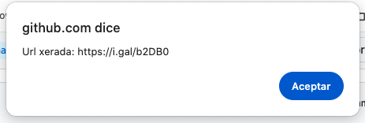

# polrchrome
Chrome extension for Polr URL shortener

You can download here: https://chrome.google.com/webstore/detail/polrchrome/knnkfbnafnjodpdfboaapmacapkdcnha

Includes images from https://github.com/cydrobolt/polr licensed under the GPLv2

For the Firefox extension please visit: https://github.com/hukoeth/polrff.git

# i.gal

- Empregar branch *i.gal*

- Amosa unha fiestra de alerta coa url xerada e tamén a copia no *portapapeis*

- Permite crear URL personalizada, se disponhemos dunha *API Key*

## Capturas

- Uso:

- Alert coa url xerada:

- Configuración:

